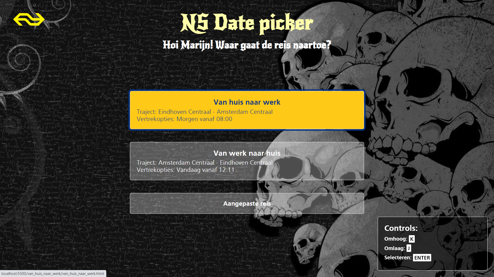
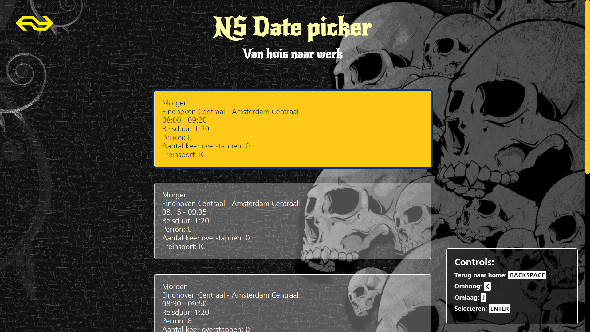

# Date picker voor Marijn Meijles
Dit project bestaat uit een interactieve toepassing die speciaal is ontworpen en ontwikkeld voor Marijn Meijles. Het betreft een date picker waarmee Marijn van tevoren kan aangeven welke trein hij wil nemen zodat er iemand is om hem te helpen met zijn rolstoel. Bij dit project is speciaal gelet op de beperkingen én interesses van Marijn. Bij dit project is enkel gebruikgemaakt van HTML, CSS en JavaScript. Er wordt, omdat het project slechts een prototype betreft, geen echte data opgehaald van de NS.

Het project is via deze link te bekijken: https://dustinschouten.github.io/human-centered-design-2122/

## Table of Contents:
  * [User needs](#user-needs)
    + [Wie is Marijn](#wie-is-marijn)
    + [Over het product](#over-het-product)
  * [Verslaglegging van de tests](#verslaglegging-van-de-tests)
    + [Eerste testmoment](#eerste-testmoment)
      - [Aannames vooraf](#aannames-vooraf)
      - [Bevindingen tijdens de ontmoeting en de test](#bevindingen-tijdens-de-ontmoeting-en-de-test)
        * [Over hoe Marijn interacteert met een computer](#over-hoe-marijn-interacteert-met-een-computer)
        * [Over de wensen en eisen van Marijn](#over-de-wensen-en-eisen-van-marijn)
      - [De testopzet](#de-testopzet)
      - [Plannen voor volgende week](#plannen-voor-volgende-week)
    + [Tweede testmoment](#tweede-testmoment)
      - [Bevindingen tijdens de ontmoeting en de test](#bevindingen-tijdens-de-ontmoeting-en-de-test-1)
      - [De testopzet](#de-testopzet-1)
      - [Plannen voor volgende week](#plannen-voor-volgende-week-1)
    + [Derde testmoment](#derde-testmoment)
      - [Bevindingen tijdens de ontmoeting en de test](#bevindingen-tijdens-de-ontmoeting-en-de-test-2)
      - [De testopzet](#de-testopzet-2)
  * [Exclusive Design Principles](#exclusive-design-principles)
    + [Study situation](#study-situation)
    + [Prioritise identity](#prioritise-identity)
    + [Ignore conventions](#ignore-conventions)
    + [Add nonsense](#add-nonsense)
  * [Conclusie](#conclusie)
  * [Bronnen](#bronnen)

## User needs
### Wie is Marijn?
Marijn Meijles woont in Eindhoven, werkt in Amsterdam en kan worden gezien als een echte nerd. Hij is internationaal gezien een expert op het gebied van muziek metadata. Hij weet alles van technologie en developen en gebruikt hiervoor zijn favoriete teksteditor VIM. Deze teksteditor vindt Marijn prettig om op zijn macbook te gebruiken omdat er bij deze veel shortcuts en dus minder handelingen nodig zijn tijdens het developen. Hier heeft Marijn behoefte aan omdat hij is geboren met een motorische stoornis en moeite heeft met fijne motoriek. Hij kan maar één hand tegelijk gebruiken (vandaar dat hij sticky keys gebruikt), en is afhankelijk van zijn toetsenbord en zijn trackpad. Verder heeft Marijn moeite om zich verstaanbaar te maken en zit hij in een rolstoel.

Zijn interesses zijn bier drinken en als een echte nerd boeken lezen. Ook houdt hij erg van dark-mode in de stijl van Heavy Metal.

### Over het product
Het product dat ik voor Marijn gemaakt heb is een NS date picker. Hiermee kan hij aangeven welke trein hij wil nemen wanneer hij gaat reizen. Dit moet hij altijd ruim van tevoren doorgeven zodat er iemand van de NS is om hem te helpen met zijn rolstoel. Als hij vroeg in de ochtend naar zijn werk reist, moet hij dit de dag van tevoren al regelen. Wanneer hij op werk zit en van plan is weer naar huis te gaan, wil hij uiteraard zo snel mogelijk weer thuis zijn. Dit kan pas op zijn vroegst een uur van tevoren geregeld worden. Als hij een andere aangepaste reis wilt maken, hangt het meer af van het moment waarop Marijn de reis boekt en van de duur van de reis.

Mijn gemaakte date picker is volledig via het toetsenbord te bedienen is. Doordat Marijn bekend is met VIM, had hij ook de voorkeur dat het product met de hjkl toetsen te bedienen is (en niet met de tab-toets die hij nooit gebruikt).

Zijn wens voor een date picker komt voort uit het feit dat de website van de NS dusdanig ontworpen is dat hij het niet prettig vindt om deze te gebruiken.

## Verslaglegging van de tests
### Eerste testmoment
#### Aannames vooraf
Voorafgaand aan de ontmoeting en de test met Marijn was er weinig achtergrondinformatie beschikbaar. In de beschrijving stond dat Marijn veel moeite heeft met fijne motoriek, dat hij daardoor zijn toetsenbord gebruikt om te navigeren en dat hij Sticky Keys aan heeft staan. Een aanname die ik hierdoor maakte, was dat hij de tab-toets en de pijltjestoetsen gebruikte om door elementen over een webpagina te navigeren. Ook nam ik aan dat Marijn niet de muis kon gebruiken.

Verder stond in de beschrijving enkel dat Marijn een date picker wilde hebben waarin hij kan aangeven welke trein hij wil nemen. De aanname die ik hierbij deed was dat hij een datum en een tijd wilde invoeren en dat hij die aan zijn helper kon doorgeven.

Op basis van deze aannames en de beschikbare informatie besloot ik een date picker te maken waarmee je met de tab-toets, pijltjestoetsen en de spatiebalk de elementen kon bedienen. Zie de screenshot hieronder:

#### Bevindingen tijdens de ontmoeting en de test
Op donderdag 21 april hadden wij de eerste ontmoeting met Marijn vanuit Eindhoven. Al snel bleek dat ik zijn motorische beperking een beetje had onderschat. Marijn heeft veel moeite om zich verstaanbaar te maken en wanneer hij zijn toetsenbord gebruikt, drukt hij soms ook per ongeluk de verkeerde toets in. Verder heb ik tijdens de ontmoeting de volgende bevindingen gedaan:

##### Over hoe Marijn interacteert met een computer
- Marijn gebruikt vooral toetsen die dicht bij elkaar staan. Het woord 'ALS' is bijvoorbeeld lastig om te typen omdat de letter A helemaal links van het toetsenbord is, de L helemaal rechts en de S weer helemaal links.
- Marijn geeft aan nooit gebruik te maken van de tab-toets.
- In plaats van de pijltjestoetsen gebruikt Marijn de H (naar links), J (naar beneden), K (naar boven) en L (naar rechts) om te bewegen (de controls te bedienen).
- De pijltjestoetsen en de spatiebalk gebruikt Marijn voornamelijk om te scrollen.
- Marijn kan zowel een toetsenbord als een trackpad gebruiken.
- Wanneer Marijn zijn toetsenbord gebruikt, kijkt hij naar zijn toetsenbord en niet naar het scherm.

##### Over de wensen en eisen van Marijn
- Marijn moet altijd een uur van tevoren de trein reserveren.
- Zijn vaste route is van Eindhoven (woonplaats) naar Amsterdam (werk). Als hij de trein naar Amsterdam neemt, moet hij die de dag van tevoren plannen. Als hij weer terug naar Eindhoven gaat, wil Marijn die zo snel mogelijk kunnen nemen. Dit geldt ook voor als Marijn ergens anders dan naar zijn werk gaat.
- Zijn trein gaat eenmaal in het kwartier.
- Marijn vindt het handig als er van tevoren al wat reisopties klaargezet worden als hij van tevoren weet hoe laat hij wilt gaan reizen.
- Ook vindt hij het handig als er al wat standaard waarden (placeholders) aanwezig zijn die waarschijnlijk al kloppen.
- Marijn vindt het voldoende als hij een week vooruit kan plannen.
- Marijn is een groot fan van Heavy Metal.

#### De testopzet
Vasilis is naar Marijn's huis gegaan en heeft een online vergadering met de studenten gestart. Hij heeft de camera van zijn laptop vervolgens gericht op het toetsenbord van Marijn's laptop, waardoor we konden zien hoe hij omgaat met zijn computer. Vervolgens hebben alle studenten één voor één hun gemaakte werk laten zien en een korte uitleg gegeven over het hoe en waarom. Verder hebben de studenten Marijn vooral zelf ons prototype laten testen. Wanneer Marijn feedback gaf over een prototype, vertaalde Vasilis wat hij duidelijk wilt maken. Deze manier van testen is prima verlopen.

#### Plannen voor volgende week
Doordat ik de opdracht in eerste instantie niet helemaal begrepen had, kwam ik aan met een data-picker die uiteindelijk veel te algemeen bevonden werd. Mijn voornaamste doel voor deze week is om de website een stuk meer in te richten op de behoeften van Marijn.

Ook had ik bijvoorbeeld een soort kalender gemaakt waarin je verschillende maanden kon selecteren. Deze functionaliteit bleek achteraf helemaal niet nodig te zijn. Bovendien gaf Marijn aan dat het weinig nut heeft om, als hij zo snel mogelijk een trein wilt nemen, tot op de minuut exact aan te kunnen geven hoe laat er een trein vertrekt. In plaats daarvan kwam al snel naar voren dat het handiger is om een aantal reisopties te geven.

Tijdens de tests van de andere studenten werd ook duidelijk dat Marijn soms per ongeluk de verkeerde toets indrukt. Daarom vond ik het een goed idee om het aantal benodigde interacties te beperken.

### Tweede testmoment
Voor het tweede testmoment heb ik geprobeerd om zoveel mogelijk rekening te houden met de voorkeuren én interesses van Marijn. Ik heb een home-menu gemaakt waarin Marijn kan kiezen tussen drie opties: 'Van huis naar werk', 'Van werk naar huis' en 'Aangepaste reis'. Dit heb ik gedaan omdat de bovenste twee opties veelvuldig door Marijn gebruikt zouden worden, waardoor Marijn vanaf het home-menu direct een aantal reisopties te zien krijgt die aansluiten bij zijn situatie. Hierbij bedoel ik dat, afhankelijk van welke optie Marijn kiest, hij altijd reisopties van over een uur of vanaf de volgende dag te zien krijgt. Zie de onderstaande twee screenshots:

Home menu:

Van huis naar werk met reisopties

Wat de aangepaste reis betreft, heb ik vier verschillende invoervelden gemaakt genaamd 'Vertrek', 'Aankomst', 'Datum' en 'Tijd'. Allevier zijn het dropdownmenu's. Marijn gaf bij de vorige test aan dat hij het prima vond als hij niet verder dan een week vooruit kon plannen en dat het niet nodig vond om op de minuut precies aan te hoeven geven hoe laat hij een trein wil nemen. Zie de screenshot hieronder:

Op het gebied van interactie gaf Marijn aan dat hij gebruikmaakte van de hjkl-toetsen. Daarom heb ik de controls op deze toetsen gebaseerd. Om extra duidelijk te maken hoe de controls werken, heb ik op iedere pagina rechtsonder uitgelegd hoe Marijn de webpagina kan bedienen.

Verder heb ik, om op de interesses van Marijn in te spelen, een achtergrondafbeelding van heavy metal toegevoegd.

#### Bevindingen tijdens de ontmoeting en de test
Op donderdag 28 april hadden wij de tweede ontmoeting met Marijn. Deze test verliep voor mijn gevoel niet helemaal goed. Ik had erg veel moeite met het verstaan van Marijn doordat er dit keer niemand was die als tolk fungeerde. Daarom heb ik voor mijn gevoel ook weinig feedback kunnen krijgen waarmee ik met de derde test verder kon gaan.

Hieronder heb ik alle bevindingen genoteerd die ik mij tijdens de testen van alle prototypes zijn opgevallen:

- Marijn wil bij het kiezen van een datum niet alleen de dag zelf, maar ook graag de dag van de week kunnen zien.
- Marijn wil de treinstations die als opties worden gegeven gesorteerd hebben op grootte/bekendheid van het station (en dus niet op alfabetische volgorde).
- Marijn kan met zijn vinger scrollen en klikken (zijn scherm is een touchscreen).
- Zijn hobby's zijn bier drinken en lezen.

Over mijn prototype kreeg ik de volgende schaarse feedback:
- Marijn vond mijn werk er mooi uitzien, maar zei wel dat ik bepaalde pagina's nog moest afmaken.
- Op zijn laptop werkte de ENTER toets niet bij 'Aangepaste reis' bij een paar invoervelden. Dit bleek achteraf makkelijk opgelost te worden.

#### De testopzet
Zoals ik al zei was er geen tolk waardoor de studenten moeite hadden met het verstaan van Marijn. Verder verliep het testen eigenlijk hetzelfde als bij de vorige test: de studenten vertelden in het kort wat zij hadden gemaakt en verder lieten wij Marijn op zijn eigen laptop de prototypes testen. De test was ditmaal niet online maar op school.

#### Plannen voor volgende week
Voor de aankomende week ben ik logischerwijs van plan om mijn webapplicatie wat verder uit te werken, op basis van de informatie die ik bij het tweede testmoment heb verkregen. Verder ga ik proberen om wat 'nonsense' toe te voegen om het design voor Marijn wat aantrekkelijker te maken. Hierbij dacht ik eraan om misschien een animatie van een rijdende trein te maken op het moment dat Marijn klaar is met het selecteren van een optie.

### Derde testmoment
Voor het derde en laatste testmoment heb ik nog meer de identiteit van Marijn naar voren laten komen. In de vorige test kwam ik erachter dat Marijn van bier en van boeken houdt. Hierbij ontstond gelijk bij mij het idee om vallende bierflesjes te tonen als Marijn klaar is met het selecteren van een reisoptie. Zie de screenshot hieronder:

Verder kwamen wij studenten erachter dat Marijn het helemaal leuk vindt om bij ieder project te zoeken naar manieren om de website 'stuk te maken'. Hiermee bedoel ik dat Marijn als echte nerdy developer probeert om 'bugs' te vinden in ieders website. Om hierop in te spelen heb ik ervoor gezorgd dat, zodra Marijn bij de pagina 'aangepaste reis' bij de invoervelden 'Vertrek' en 'Aankomst' hetzelfde treinstation invoert, er een bug verschijnt. Alle content op de pagina wordt verwijderd, behalve de twee invoervelden en de achtergrond verandert in een heftigere heavy metal. Zie de screenshot hieronder:

#### Bevindingen tijdens de ontmoeting en de test
Op donderdag 12 mei hadden wij de derde en laatste ontmoeting met Marijn. Hieronder heb ik alle bevindingen genoteerd die tijdens deze test naar voren kwamen:

- Marijn gaf aan dat hij elke dag om half 10 's-ochtends de trein naar zijn werk neemt.
- Marijn was erg blij met mijn eindresultaat en met name de vallende biertjes vond hij erg leuk bedacht. En nadat ik een paar hints gaf, lukte het hem ook nog om de bug te vinden over de invoervelden bij de stations.
- Marijn was ook positief over het feit dat de zichtbare reisopties bij 'Aangepaste reis' live mee veranderen op het moment dat je één van de invoervelden wijzigde.
- Marijn had wel één opmerking: hij vond het een beetje onlogisch dat je niet de H- en de L-toets kon gebruiken om van de invoervelden naar de reisopties (dus van links naar rechts en andersom) kon navigeren. Dit kan bij mijn prototype voor nu alleen met de J- en de K-toets (omhoog en omlaag).

Ik had bij de pagina 'Van huis naar werk' het vroegste tijdstip op 08:00 uur gezet. Nadat Marijn aangaf elke dag pas om 09:30 te vertrekken, heb ik dat snel even aangepast. Echter had ik, in verband met de deadline van dit vak, geen tijd meer om met zijn opmerking over de het gebruik van de H- en de L-toets aan de slag te gaan.

Wanneer ik eventueel in de toekomst dit project verder uit zal werken, zal ik dus proberen om deze issue wel te verbeteren, zodat het voor Marijn logischer aanvoelt om door mijn pagina te navigeren. Wat ik ook nog in de toekomst zou kunnen doen, is het prototype koppelen aan de API van de NS, zodat de weergegeven reisopties overeenkomen met de werkelijkheid.

#### De testopzet
De testopzet was exact hetzelfde als bij de vorige ontmoeting. Alleen was Vasilis er dit keer wel bij.

## Exclusive Design Principles
### Study situation
In het kader van study situation vond ik het erg belangrijk om een product te maken waarbij Marijn in zo min mogelijk handelingen zijn treinreis van A naar B kan aangeven. Doordat Marijn vaak dezelfde treinreis neemt, namelijk van Eindhoven naar Amsterdam en weer terug, heb ik ervoor gekozen om deze treinreizen in één directe handeling op het scherm te tonen. In het kader van gebruikersinteractie heb ik de website volledig toegankelijk gemaakt met het toetsenbord, en in zijn specifieke situatie met de J- en de K-toets (afkomstig van VIM). Hierbij is het ook van belang dat Marijn het product gemakkelijk met één hand tegelijk kan bedienen.

### Prioritise identity
Dit onderwerp valt naar mijn idee een beetje samen met add nonsense. Het doel van dit onderwerp is dat je aan de date picker echt goed kan zien voor wie het is gemaakt. Je moet als het ware meteen doorkrijgen welke technische achtergrond en interesses deze persoon heeft. Marijn houdt bijvoorbeeld van een dark-mode stijl en van heavy metal. Ook het font dat voor de titel en subtitel gebruikt is, draagt bij aan de wat duistere stijl waar Marijn van houdt.

### Ignore conventions
Bij het maken van websites moet er normaal gesproken rekening gehouden worden met allerlei verschillende groepen gebruikers. Hierbij hoor je je te houden aan een aantal conventies, waardoor zoveel mogelijk mensen jouw website zonder problemen kunnen gebruiken.
Doordat je hier slechts voor één specifiek persoon een website ontwikkelt, hoef je je niet te houden aan al deze conventies. Hier zal ik een paar voorbeelden geven:

- Doordat Marijn nooit gebruikmaakt van de tab-toets, is het ook niet nodig om deze functionaliteit te laten werken. In plaats daarvan gebruikt Marijn de hjkl-toetsen om door de elementen te navigeren.

- Doordat Marijn deze toepassing altijd op zijn laptop op een groot scherm gebruikt, is het niet nodig om de website responsive te maken voor kleinere schermen.

- Ook dit onderwerp valt een beetje samen met add nonsense, maar zoals ik al eerder noemde, vindt Marijn het erg leuk om bugs op te sporen. Daarom heb ik expres een zogenaamde bug 'verstopt' (wel makkelijk te vinden) bij de pagina 'aangepaste reis'. Bij 'normale' gebruikers is het een goede gewoonte om gewoon een duidelijke foutmelding te geven.

Verder vond ik het voor Marijn niet echt noodzakelijk om veel andere aanpassingen te maken, omdat Marijn zelf ook erg veel weet van websites.

### Add nonsense
Ik had eerst het idee om een animatie van een rijdende trein te laten afspelen op het moment dat Marijn een reisoptie heeft gekozen. Later dacht ik dat dit wellicht toch iets te weinig met de interesses van Marijn te maken had en ook een beetje kinderachtig was.
Tijdens de eerste twee tests kwam naar voren dat Marijn van bier en van boeken houdt, en dat hij verder niet veel hobby's heeft doordat Marijn het regelmatig druk heeft. Omdat ik zelf ook van bier houd, leek het me leuk om allemaal vallende bierflesjes te laten zien als Marijn een reisoptie heeft gekozen.

## Conclusie / reflectie
Over het geheel gezien vond ik dit best een lastig vak. Het maken van de prototypes was, ondanks dat ik daar toch wel wat dagen zoet mee was, voor mij niet het moeilijkst. De moeilijkheid zat echter in het nadenken over de design principles en het goed laten testen van mijn prototype door Marijn. Ook had ik moeite met het gebrek aan duidelijkheid in de eerste paar dagen van dit vak. In de beschrijving stond kort waar Marijn behoefte aan had, welke beperking hij had en hoe hij interacteerde met zijn computer. Doordat ik in de eerste week nog niet echt rekening hield met de design principles, kwam ik er na de eerste ontmoeting achter dat mijn date picker nog niet goed genoeg was. Later leerde ik hiervan dat het helemaal niet erg is dat een prototype ook erg kan mislukken.

Wat ik dus echt lastig vond was het communiceren met Marijn. Het heeft er ook een beetje mee te maken dat ik van jongs af aan (nu gelukkig wat minder) moeite met sociale contacten en zijn verstaanbaarheid hielp daar helaas niet bij. Dit vond ik vooral tijdens de tweede test echt vervelend toen er ook geen docenten bij waren die Marijn konden vertolken.

Ondanks dat vond ik het sowieso wel erg interessant (en ook een beetje spannend) om te zien hoe andere mensen met jouw prototype omgaan. Dat was ik namelijk nog niet zo gewend. Ik heb wel vaker wat hobbyprojecten gemaakt en aan andere mensen laten zien, maar nog nooit eerder heb ik specifiek iets voor iemand gemaakt die ik persoonlijk nog niet kende. Het deed me daarom ook wel weer goed dat Marijn vertelde dat ik goed bezig was en dat hij het er erg leuk uit vond zien. Vooral al die verrassende elementen (de vallende biertjes en de bug bij de stations invoer) deden het erg goed. Dit vond ik uiteraard zelf ook erg leuk om toe te voegen.

Wat het testen zelf betreft, heb ik wel geleerd dat er voor mij één beste manier van testen is: vooral niet te veel inbreng geven en de testpersoon zelf overal achter laten komen. Op die manier kom je tot de beste inzichten.

Al met al ben ik erg tevreden met wat ik in drie weken voor Marijn heb kunnen maken.

## Bronnen
- https://exclusive-design.vasilis.nl/
- https://wallpaper.dog/metal
- https://wall.alphacoders.com/by_sub_category.php?id=173488&name=Heavy+Metal+Wallpapers&lang=German
